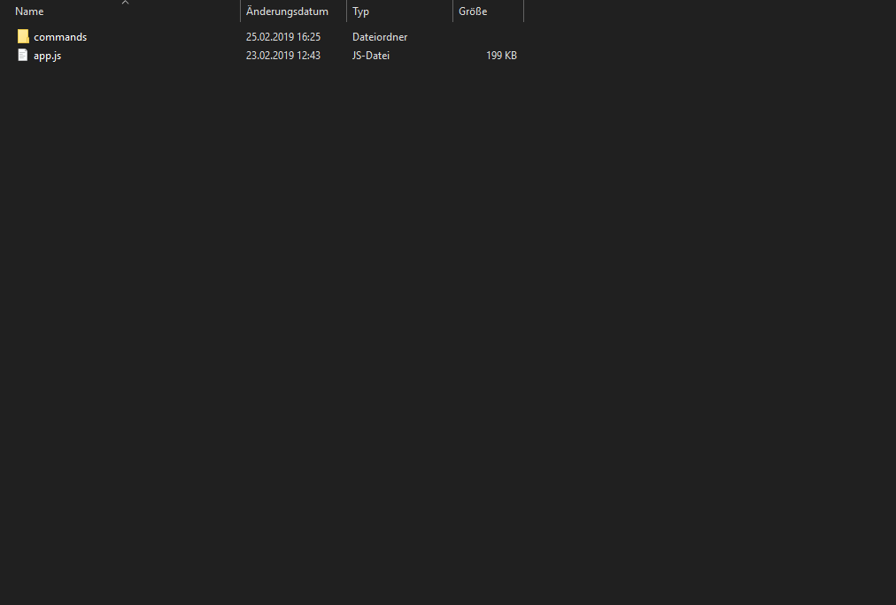
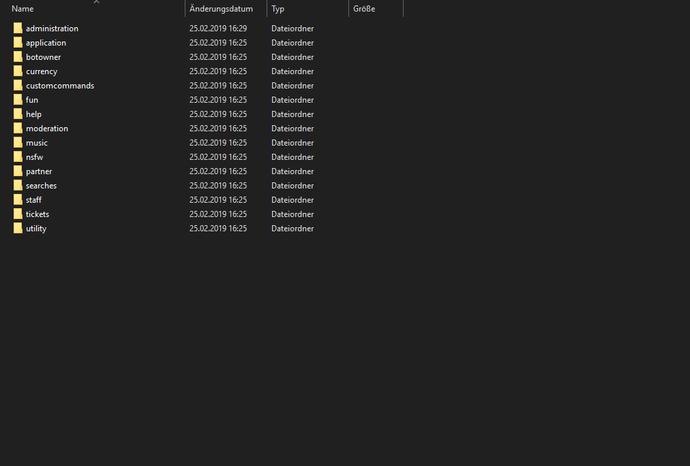
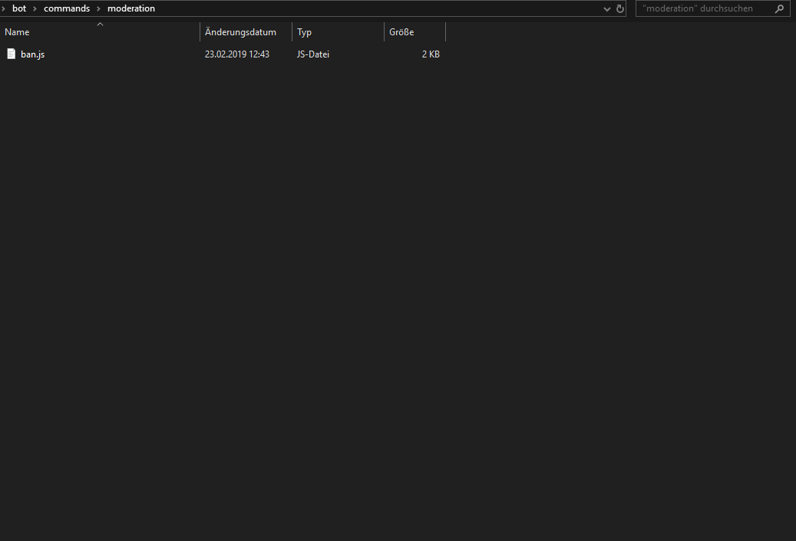

# Command handler

## What is our goal with this new command handler?

This command handler offers you a much clearer overview of everything in your bot directory. It allows you to have a seperated JavaScript file for each command you want to have. You can easily define aliases, a fancy description, ... for your new commands. It makes it much easier for you to manage everything and to find bugs. 

Trust me, you will have a lot more fun with it.

## What benefits does the following command handler offer?

* You can create a file for **each** command you create
* You can use **modules** to organize your commands
* **Much clearer overview**
* Main file has **much less** lines of code
* **Aliases** for **each** command
* Defining **as much** as you want for **each** command \(required bot permissions, required user permissions, description, ...\)

## Let's start with programming

Let's start, as always, with the basic setup of our command handler. If I were you, I would put this code in the start file of your bot \(_**Example:**_ ****`bot.js`\).

```javascript
const Discord = require('discord.js'); // Require discord.js
const client = new Discord.Client(); // Discord.js Client (Bot)

client.commands = new Discord.Collection(); // Collection for all commands
client.aliases = new Discord.Collection(); // Collection for all aliases of every command
```

First we definend Discord for our Discord client and Collections. 

In the further code lines that've added, we define two new Discord collections. The first saves all commands of the bot. The second saves all aliases of each command of the bot.


```javascript
const Discord = require('discord.js'); // Require discord.js
const client = new Discord.Client(); // Discord.js Client (Bot)

client.commands = new Discord.Collection(); // Collection for all commands
client.aliases = new Discord.Collection(); // Collection for all aliases of every command

const modules = ['administration', 'moderation']; // This will be the list of the names of all modules (folder) your bot owns
```

As you can see, we added the new variable **modules** where you put the names of all modules in it. 

**Be aware that also your folder will be named like this!**

\*\*\*\*

```javascript
const Discord = require('discord.js'); // Require discord.js
const client = new Discord.Client(); // Discord.js Client (Bot)

client.commands = new Discord.Collection(); // Collection for all commands
client.aliases = new Discord.Collection(); // Collection for all aliases of every command

const modules = ['administration', 'moderation']; // This will be the list of the names of all modules (folder) your bot owns

const fs = require('fs'); // Require fs to go throw all folder and files

modules.forEach(c => {
	fs.readdir(`./commands/${c}/`, (err, files) => { // Here we go through all folders (modules)
		if (err) throw err; // If there is error, throw an error in the console
		
		console.log(`[Commandlogs] Loaded ${files.length} commands of module ${c}`); // When commands of a module are successfully loaded, you can see it in the console

		files.forEach(f => { // Now we go through all files of a folder (module)
			const props = require(`./commands/${c}/${f}`); // Location of the current command file
			
			client.commands.set(props.help.name, props); // Now we add the commmand in the client.commands Collection which we defined in previous code
			
			props.conf.aliases.forEach(alias => { // It could be that the command has aliases, so we go through them too
				client.aliases.set(alias, props.name); // If we find one, we add it to the client.aliases Collection
			});
		});
	});
});
```

In the first new code line we require `fs`, which we need to go through all our files and folders of our bot.

As you can notice, we do a .forEach through our modules array which has all names of our bot's modules. In further code we look into every folder which is located in ./commands. If we don't find any folder, the bot throws an error in the console. If the bot finds a folder, he loads all the files which are located in this folder. Then we do another .forEach through all files which are located in the current folder. 

In this .forEach we first define the location of our command file with the name props. After this we add the command file in our client.commands Discord Collection which we defined in our previous code.

The last thing that've added, is another .forEach which we need to check for any aliases of our command file. If the command has alias\(es\) we add them to our client.aliases Collection which we also defined in previous code.


### I do not quite understand where the whole folder should be...







## Conclusion

I hope I could help you a little bit with your bot and the setup of your ban command. If you have any questions, you can join [our Discord server.](https://lenoxbot.com/discord)

[**About me**](../../about-me.md)\*\*\*\*

